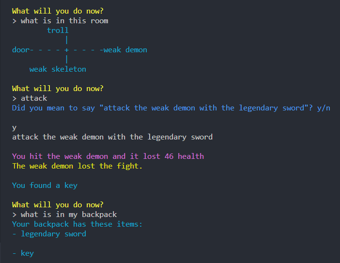

# GF-RPG-Chatbot

A chatbot that allows playing text based RPG game. Input is parsed with Grammatical Framework.
The goal of the game is to reach as many rooms as possible while gathering items and fighting enemies.
Game cannot end as of yet, as I couldn't bother to add an ending.

## How to run

- Clone repository
- Make sure to have pgf installed
- Run command `pip install -r requirements.txt`
- Go to directory src with `cd src`
- Run `python rpg_bot.py`

#### Remarks/To-do

- Tests are outdated as of now, and I might update them to match current game at some point.
- Game does have sounds but they are disabled, as they did not work in WSL2 (Windows subsystem for Linux).
  To get sounds working, uncomment sound related function and imports in src/utils.py file.

## Grammatical features:

- Input suggestions with Tab key
- Predicting correct input
- Concrete grammar only in English at the moment

## Game features:

- Item system with attributes
- Different types of items
- Enemy system with different attributes
- Enemies that can have items
- Generative room design

## Screenshots of the game

### Describing enemies

### Fighting enemies

### Finding items by looting and equipping them

### Opening locked entities

## Possible inputs

### Question commands

- what is in this room
- what is around me
- what is in my backpack
- what is on my head
- what is on my legs

### Direct commands

- attack \<enemy\> with \<weapon\>
- attack with \<weapon\> (if in combat with someone)
- describe \<enemy\>
- open the \<object\>
- loot the \<object\>
- search the \<object\>
- move \<direction\>
- equip \<item\>
- unequip \<item\>
- drop \<item\>

## Predictions

Program will try to predict the input of the user as long as at least one word has been written.
Suggestion come from GF and they are filtered to fit the context before presenting to user.
This means that predictions rarely give options that cannot happen (e.g attacking enemy that does not exist.)

## Tab-completion menu

Tab-completion menu can be displayed by pressing tab without input.
You can also open it by writing some complete word such as "attack ".
